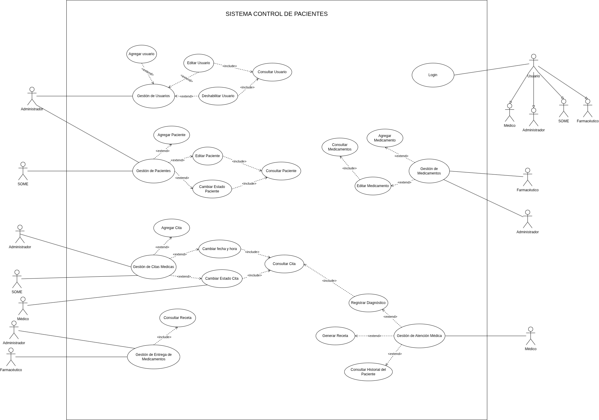
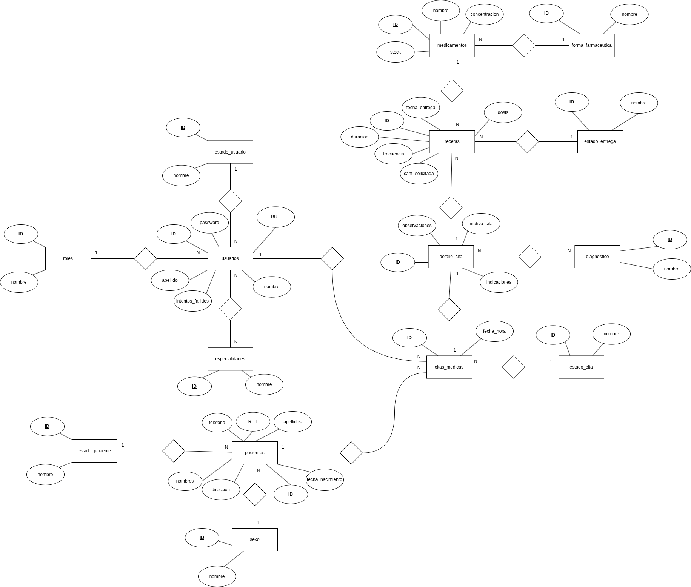
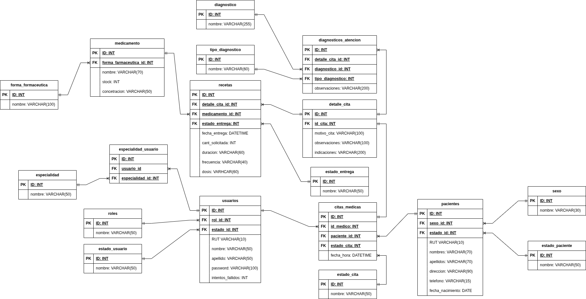
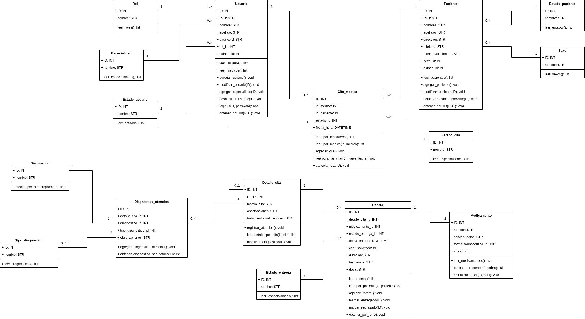

# PyCesfam: Sistema de Gestión de Pacientes (CLI)

**PyCesfam** es un sistema de software diseñado para administrar el flujo de información de un Centro de Salud Familiar (CESFAM). El proyecto está construido en **Python** con una interfaz de línea de comandos (CLI) y utiliza **MySQL** para la persistencia de datos.

El objetivo principal es asegurar la integridad de los datos clínicos y administrativos, permitiendo una gestión eficiente de citas, pacientes, historiales médicos y farmacia, respetando estrictamente los niveles de acceso según el rol del usuario.

## 📋 Tabla de Contenidos
- [Arquitectura del Sistema](#-arquitectura-del-sistema)
- [Funcionalidades y Roles](#-funcionalidades-y-roles)
- [Seguridad](#-seguridad)
- [Modelo de Datos](#-modelo-de-datos)
- [Requisitos e Instalación](#-requisitos-e-instalación)
- [Primer Acceso (Super Usuario)](#-primer-acceso)

---

## 🏗 Arquitectura del Sistema

El sistema sigue una arquitectura basada en capas, separando la lógica de negocio (Python), la interfaz de usuario (Consola/CLI) y la capa de datos (MySQL).

### Documentación Técnica

**1. Diagrama de Casos de Uso**
Define las interacciones entre los actores y el sistema.


**2. Modelo Entidad-Relación (MER)**
Representación conceptual de los datos.


**3. Modelo Lógico/Físico**
Estructura normalizada de la base de datos.


**4. Diagrama de Clases UML**
Diseño de objetos y métodos del backend.


---

## 👥 Funcionalidades y Roles

El sistema implementa un control de acceso basado en roles (RBAC) con cuatro actores principales:

### 1. Administrador
Encargado de la configuración y mantenimiento del sistema.
* **Gestión de Usuarios:** Crear, editar y deshabilitar cuentas de personal.
* **Supervisión:** Acceso a reportes generales de farmacia y citas.
* **⚠️ Restricción de Privacidad:** El administrador **NO tiene acceso** al módulo de *Gestión de Atención Médica*. No puede visualizar diagnósticos, detalles de consultas ni historiales clínicos sensibles.

### 2. Médico
Profesional de la salud encargado de la atención clínica.
* **Gestión de Atención Médica:** Realizar consultas, registrar diagnósticos y observaciones.
* **Historial:** Visualizar el historial clínico del paciente.
* **Recetas:** Generar recetas médicas vinculadas a la atención.

### 3. Farmacéutico
Encargado de la dispensación de medicamentos.
* **Gestión de Medicamentos:** Crear y editar inventario de fármacos.
* **Entrega:** Consultar recetas, marcar medicamentos como entregados y actualizar stock automáticamente.

### 4. SOME (Servicio de Orientación Médico Estadístico)
Personal administrativo de admisión.
* **Gestión de Pacientes:** Ingreso (CRUD) de pacientes, actualización de datos demográficos.
* **Agendamiento:** Reserva, confirmación y anulación de citas médicas.

---

## 🔒 Seguridad

El sistema implementa estándares de seguridad para proteger la información sensible:
* **Hashing de Contraseñas:** Todas las contraseñas se almacenan encriptadas utilizando el algoritmo **bcrypt**. Nunca se guardan en texto plano.
* **Sanitización de Consultas:** Uso de consultas parametrizadas para prevenir inyección SQL.

---

## 🗄 Modelo de Datos

La base de datos está diseñada en **MySQL** bajo un esquema relacional normalizado. El script de instalación incluye catálogos precargados para:
* Roles y Estados (Usuarios, Citas, Pacientes).
* Especialidades Médicas.
* Listado base de Diagnósticos comunes.

### Tablas Principales
* **`pacientes`:** Almacena RUT, nombres, fecha de nacimiento, sexo, dirección.
* **`usuarios`:** Credenciales de acceso y roles del personal.
* **`citas_medicas`:** Tabla central que vincula paciente, médico y estado de la hora.
* **`detalle_cita`:** Almacena la información clínica (motivo consulta, indicaciones).
* **`medicamentos` y `recetas`:** Gestión de inventario y prescripciones.

---

## ⚙️ Requisitos e Instalación

### Requisitos Previos
* Python 3.8 o superior.
* Servidor MySQL (Local o Remoto, ej: XAMPP/WAMP).
* Librerías de Python: `mysql-connector-python`, `bcrypt`.

### Instalación Paso a Paso

1.  **Clonar el repositorio:**
    ```bash
    git clone [https://github.com/MarcoAntaniom/PyCesfam.git](https://github.com/MarcoAntaniom/PyCesfam.git)
    cd PyCesfam
    ```

2.  **Instalar dependencias:**
    ```bash
    pip install mysql-connector-python bcrypt
    ```

3.  **Configurar Base de Datos:**
    * Crear una base de datos vacía en MySQL llamada `py_cesfam`.
    * Importar el script SQL ubicado en la carpeta `/bd/`:
      ```
      /bd/py_cesfam.sql
      ```
    * *Nota:* Este script crea las tablas y puebla los catálogos necesarios.

4.  **Configurar Conexión:**
    * Verificar las credenciales de conexión en el archivo `main.py` o módulo de conexión correspondiente.

5.  **Ejecutar el Sistema:**
    ```bash
    python main.py
    ```

---

## 🔑 Primer Acceso

Para iniciar el sistema por primera vez, utilice las credenciales del **Super Usuario** preconfigurado (o el que debe ser creado mediante el script de inicialización):

| Rol | RUT (Usuario) | Contraseña Inicial |
| :--- | :--- | :--- |
| **Administrador** | **1-9** | **admin123** |

---
*Desarrollado por [MarcoAntaniom](https://github.com/MarcoAntaniom) para el proyecto de modernización de gestión clínica (2026).*